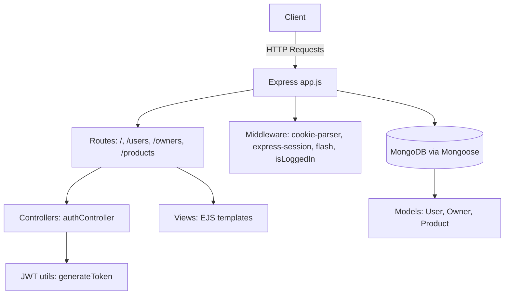

# E-commerce Node.js App

A simple e-commerce starter built with **Node.js**, **Express**, **EJS**, and **MongoDB**.  
Supports user registration, login with JWT cookies, and product listing pages.

---

## Tech Stack

- **Backend:** Node.js, Express  
- **Frontend:** EJS templates, TailwindCSS (CDN)  
- **Database:** MongoDB with Mongoose  
- **Authentication:** JWT via httpOnly cookies  
- **Middleware:** Express session, connect-flash  

---

## Features

- User signup/login with hashed passwords and JWT cookie-based authentication.  
- Protected shop page with product grid rendered from MongoDB.  
- Owner bootstrap route to create the first admin user.  

---

## Architecture Diagram



## Project Structure

```

app.js             # App entry point: middleware, routers, EJS setup, static files, server start
routes/            # Routers: index, users, owners, products
controllers/       # authController for register/login/logout
models/            # Mongoose schemas: User, Owner, Product
views/             # EJS templates: index, shop, admin, cart, partials

````

---

## Setup

### Prerequisites

- Node.js installed
- MongoDB database and connection string

### Install Dependencies

```bash
npm install
````

### Environment Variables

Create a `.env` file with the following:

```bash
MONGODB_URI=<your-mongodb-connection-string>
JWT_SECRET=<your-jwt-secret>
SESSION_SECRET=<your-session-secret>
```

---

## Running the App

### Development

```bash
npm run dev
```

* Runs the app with **nodemon**.
* Accessible at: [http://localhost:3000](http://localhost:3000)

### Production

```bash
npm start
```

* App listens on port 3000.

---

## Contributing

1. Fork the repository.
2. Create a feature branch.
3. Commit your changes.
4. Push and open a Pull Request.


